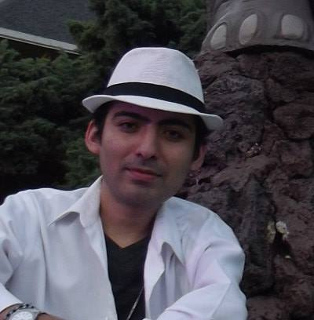

# Cody cooking

Eres desarrollador? entra en [modo dev](./ReadmeDev.md)

El proyecto esta realiado vpn React + TypeScript + Vite + zustand

<table>
    <tbody>
        <tr>
            <td rowspan=4 align="center">Agustín Sebastián Piuca Quevedo</td>
            <td align="center">Soy una persona recien graduada de la Tecnicatura de ingeniería en sistemas y me interesa mucho el área del Frontend, tengo conocimientos bastante amplios en tecnologías como HTML, CSS, Javascript, React entre otros.

Actualmente me sigo formando como Frontend Developer para poder ejercer funciones de dicho stack y sacar proyectos adelante de la mano de personas con otros perfiles.

Tengo mucha curiosidad por el lado del Diseño UX/UI para poder crear interfaces bastante funcionales y llamativas de cara a los usuarios, y así lograr un perfíl de UI Developer, por lo que tambien estoy viendo bastante material relacionado a ello.</td>

</tr>
<tr>
<td align="center">
<a href="https://www.linkedin.com/in/agustin-sebastian-piuca-quevedo">Linkedin</td>
</tr>
</tbody>
</table>

<table>
    <tbody>
        <tr>
            <td rowspan=4 align="center">Francisco Javier Santoyo Rios</td>
            <td align="center">Soy desarrollador web Full Stack especializado en backend, frontend y testing, titulado en LTI. A pesar de tener una discapacidad motriz, busco oportunidades de desarrollo remoto.
             
            Tengo experiencia en proyectos remotos, trabajando con responsabilidad, en equipo y siguiendo las políticas de privacidad del cliente/empresa. Estoy comprometido con ofrecer soluciones de calidad en el desarrollo web.
            </td>
        </tr>
<tr>
<td align="center">
<a href="https://www.linkedin.com/in/javiersantoyor">Linkedin</a>
<a href="https://javiersantoyo.dev/">Portafolio</a>
<a href="https://twitter.com/FcoSantoyoRios">Twitter{X}</a>
</td>
</tr>
</tbody>
</table>

<table>
    <tbody>
        <tr>
            <td rowspan=4 align="center">Mayra Macedo</td>
            <td align="center">Soy una desarrolladora front. Siempre dispuesta a aprender cosas nuevas, a sumergirme en nuevos desafíos y tecnologías para mejorar mis habilidades y contribuir al desarrollo de soluciones web innovadoras. Me encanta la tecnología. Además de mi enfoque en el desarrollo frontend, también tengo interés en el diseño de interfaces de usuario (UI) y la experiencia de usuario (UX). Considero que es importante comprender cómo los usuarios interactúan con una aplicación y diseñar interfaces intuitivas es fundamental para crear productos exitosos  🙌 ✨.
            </td>
        </tr>
<tr>
<td align="center">
<a href="https://www.linkedin.com/in/vanessa-macedo-huaman?utm_source=share&utm_campaign=share_via&utm_content=profile&utm_medium=android_app">Linkedin</a>
</td>
</tr>
</tbody>
</table>
