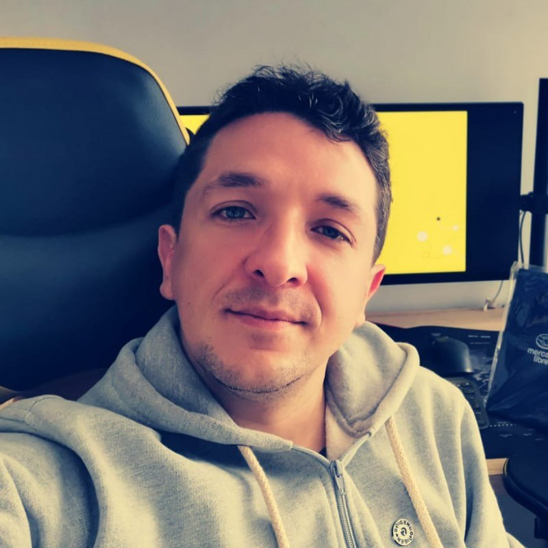

# Cody cooking

Eres desarrollador? entra en [modo dev](./ReadmeDev.md)
---

<table>
    <tbody>
        <tr>
            <td align="center">Cody cooking es un proyecto desarrollado pensando en buscar recetas fácilmente y tener tu propio “Recetario” para consultarla cuando lo requieras así seas novato o un chef, siempre tendrás a la mano tus recetas favoritas.

 
Cody cooking ayudando en la cocina…
            </td>
            <td rowspan=4 align="center">
            </td>
        </tr>
<tr>
<td align="center">
<a href="https://codycooking.netlify.app/">Cody cooking</a>
</td>
</tr>
</tbody>
</table>

## Desarrolladores

<table>
    <tbody>
        <tr>
            <td rowspan=4 align="center">Agustín Sebastián Piuca Quevedo</td>
            <td align ="center">Soy un desarrollador que le interesa mucho el área del Frontend, tengo conocimientos bastante amplios en tecnologías como HTML, CSS, y Javascript. Actualmente me sigo formando como Frontend Developer para poder ejercer funciones de dicho stack y sacar proyectos adelante de la mano de personas con otros perfiles, tambien tengo mucha curiosidad por el lado del Diseño UX/UI para crear interfaces de usuario increíbles.</td>
</tr>
<tr>
<td align="center">
<a href="https://www.linkedin.com/in/agustin-sebastian-piuca-quevedo">Linkedin</td>
</tr>
</tbody>
</table>

<table>
    <tbody>
        <tr>
            <td rowspan=4 align="center">Francisco Javier Santoyo Rios</td>
            <td align="center">Soy desarrollador web Full Stack especializado en backend, frontend y testing, titulado en LTI. A pesar de tener una discapacidad motriz, busco oportunidades de desarrollo remoto.
             
            Tengo experiencia en proyectos remotos, trabajando con responsabilidad, en equipo y siguiendo las políticas de privacidad del cliente/empresa. Estoy comprometido con ofrecer soluciones de calidad en el desarrollo web.
            </td>
        </tr>
<tr>
<td align="center">
<a href="https://www.linkedin.com/in/javiersantoyor">Linkedin</a>
<a href="https://javiersantoyo.dev/">Portafolio</a>
<a href="https://twitter.com/FcoSantoyoRios">Twitter{X}</a>
</td>
</tr>
</tbody>
</table>

<table>
    <tbody>
        <tr>
            <td rowspan=4 align="center">Mayra Macedo</td>
            <td align="center">¡Hola! Soy una desarrolladora front . Siempre dispuesta a aprender cosas nuevas, a sumergirme en nuevos desafíos y tecnologías para mejorar mis habilidades y contribuir al desarrollo de soluciones web innovadoras 🙌 ✨.
            </td>
        </tr>
<tr>
<td align="center">
<a href="https://www.linkedin.com/in/vanessa-macedo-huaman?utm_source=share&utm_campaign=share_via&utm_content=profile&utm_medium=android_app">Linkedin</a>
</td>
</tr>
</tbody>
</table>
<table>
    <tbody>
        <tr>
            <td rowspan=4 align="center">Jose Montenegro Garzón</td>
            <td align="center">Soy publicista y diseñador gráfico de profesión, pero frontend de corazón. Cuento con varios años de experiencia en el desarrollo de aplicaciones crossbrowsing, principalmente con React. Me apasiona mantenerme actualizado y siempre estoy dispuesto a ayudar y enseñar en todo lo que pueda.
            </td>
        </tr>
<tr>
<td align="center">
<a href="https://www.linkedin.com/in/jose-montenegro-808b1b56/">Linkedin</a>
</td>
</tr>
</tbody>
</table>
