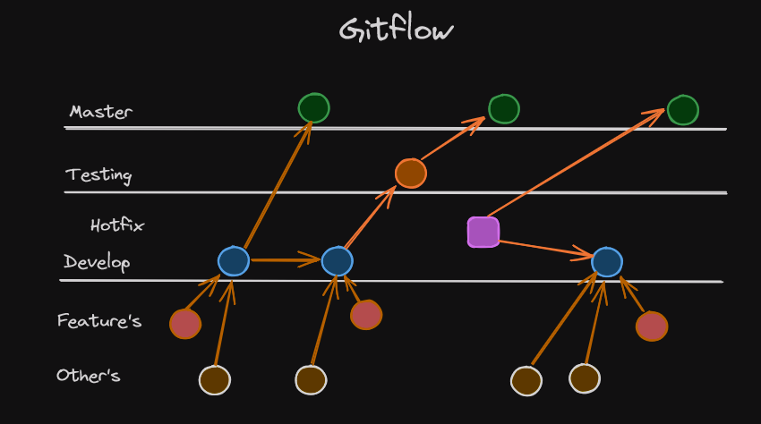

# Developer zone

Welcome to the team, this is the basic about the project, if you have any question, please talk with your developer partner.

## Setup

- Node.js v21.7.1
- ReactJs v18.2
- Create your branch
- Merge only on develop

## Folder structure

## Gitflow

## Figma design

[Figma](https://www.figma.com/file/6ThLmgDx4MBJiY7gcbl4Iz/Cody-Cooking-Prototype?type=design&node-id=0%3A1&mode=design&t=jgKdDBiHnHxM1gM8-1)

## Fetch structure

Site: [The meal db](https://www.themealdb.com/api.php)

### Search meal by name

`https://www.themealdb.com/api/json/v1/1/search.php?s=[strMeal]` Needs strMeal

| Name                | Type    | Description                                                   |
| ------------------- | ------- | ------------------------------------------------------------- |
| idMeal              | Integer | Id unico del platillo                                         |
| strMeal             | String  | Nombre del platillo                                           |
| strCategory         | String  | Categoria del platillo                                        |
| strInstructions     | String  | Instrucciones de preparacion del platillo                     |
| strMealThumb        | String  | Link de imagen html                                           |
| strTags             | String  | Tags realacionados al platillo                                |
| strIngredient[1~20] | String  | Cantidad de ingredientes necesarios para el platillo (max 20) |

### Lookup full meal details by id

`www.themealdb.com/api/json/v1/1/lookup.php?i=[idMeal]` Needs idMeal

| Name                | Type    | Description                                                   |
| ------------------- | ------- | ------------------------------------------------------------- |
| idMeal              | Integer | Id unico del platillo                                         |
| strMeal             | String  | Nombre del platillo                                           |
| strCategory         | String  | Categoria del platillo                                        |
| strInstructions     | String  | Instrucciones de preparacion del platillo                     |
| strMealThumb        | String  | Link de imagen html                                           |
| strTags             | String  | Tags realacionados al platillo                                |
| strIngredient[1~20] | String  | Cantidad de ingredientes necesarios para el platillo (max 20) |

### List all meal categories

`www.themealdb.com/api/json/v1/1/categories.php`
Don't need parameters

| Name                   | Type    | Description                   |
| ---------------------- | ------- | ----------------------------- |
| idCategory             | Integer | Id de la categoria            |
| strCategory            | String  | Nombre de la categoria        |
| strCategoryThumb       | String  | Link completo de la categoria |
| strCategoryDescription | String  | Descripcion de la categoria   |

### List all Categories

`www.themealdb.com/api/json/v1/1/list.php?c=list` Don't need parameters

| Name        | Type   | Description          |
| ----------- | ------ | -------------------- |
| strCategory | String | name of the category |

---
